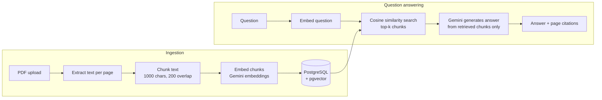

# PDF Question Answering API (RAG)

A Retrieval-Augmented Generation (RAG) backend that lets you upload PDFs and ask questions about them. Answers are grounded in the document's content and cite the pages they came from.

Built with **FastAPI**, **PostgreSQL + pgvector**, and the **Google Gemini API**.

## How it works



1. **Ingestion:** text is extracted page by page with `pypdf`, split into overlapping chunks that never cut words in half, embedded with `gemini-embedding-001` (768 dimensions), and stored in PostgreSQL using the `pgvector` extension.
2. **Retrieval:** the question is embedded the same way, and pgvector ranks chunks by cosine distance to find the most relevant ones.
3. **Generation:** the top chunks are passed to Gemini with instructions to answer only from that context, cite page numbers, and say so when the answer isn't in the document.

## Tech stack

| Layer | Choice |
|---|---|
| API | FastAPI, Pydantic |
| Database | PostgreSQL 16 + pgvector (Docker) |
| ORM | SQLAlchemy 2.0 |
| PDF parsing | pypdf |
| Embeddings | Gemini `gemini-embedding-001` (768-dim, separate document/query task types) |
| LLM | Gemini Flash |
| Tests | pytest |

## Design decisions

- **Word-boundary chunking with overlap.** Chunks end at a space, and the overlap window is moved forward to the next word start, so no chunk begins or ends mid-word. A unit test (`test_words_are_not_split`) guards this.
- **Asymmetric embeddings.** Documents are embedded with `RETRIEVAL_DOCUMENT` and questions with `RETRIEVAL_QUERY`, which Gemini tunes to match each other.
- **Non-blocking external calls.** Gemini calls run in a thread pool (`run_in_threadpool`) so slow network requests don't block FastAPI's event loop.
- **Grounded answers.** The prompt restricts the model to retrieved context and requires page citations, reducing hallucination. The API also returns the source chunks so answers can be verified.
- **Input validation.** Only PDFs are accepted, uploads are capped at 10 MB, and scanned PDFs with no extractable text are rejected with a clear error.

## API

| Method | Endpoint | Description |
|---|---|---|
| `POST` | `/documents` | Upload a PDF; extracts, chunks, embeds and stores it |
| `GET` | `/documents` | List uploaded documents with chunk counts |
| `POST` | `/ask` | Ask a question; returns an answer with sources |

Example request to `/ask`:

```json
{
  "question": "Which cloud tools are mentioned?",
  "document_id": 2,
  "top_k": 5
}
```

Example response:

```json
{
  "answer": "The document mentions AWS and CloudWatch (page 1).",
  "sources": [
    { "page": 1, "chunk_id": 7, "preview": "Analyze application logs using Splunk and AWS CloudWatch..." }
  ]
}
```

`document_id` is optional; leave it out to search across all documents.

## Running locally

**Prerequisites:** Python 3.11+, Docker Desktop, and a free Gemini API key from [Google AI Studio](https://aistudio.google.com).

```bash
# 1. Configure environment
cp .env.example .env          # Windows: copy .env.example .env
# then add your GEMINI_API_KEY to .env

# 2. Start PostgreSQL with pgvector
docker compose up -d

# 3. Install dependencies
python -m venv .venv
source .venv/bin/activate     # Windows: .venv\Scripts\activate
pip install -r requirements.txt

# 4. Run tests
python -m pytest

# 5. Start the API
uvicorn app.main:app --reload
```

Open http://localhost:8000/docs to try the endpoints in the browser.

The database runs on host port **5433** to avoid clashing with a local PostgreSQL install.

## Project structure

```
app/
  db.py        Database engine, session, and table setup
  models.py    Document and Chunk tables (Chunk has a pgvector column)
  ingest.py    PDF text extraction and chunking
  llm.py       Gemini embedding and answer generation
  main.py      FastAPI endpoints
tests/
  test_ingest.py   Unit tests for chunking
```

## Roadmap

- Retrieval and answer-quality evaluation on a small test set
- Hybrid search (keyword + vector) and reranking
- Streaming responses
- Delete endpoint and duplicate-upload detection
- Deployment to AWS
