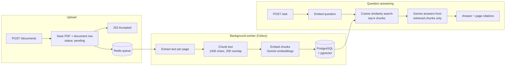

# PDF Question Answering API (RAG)

A Retrieval-Augmented Generation (RAG) backend that lets you upload PDFs and ask questions about them. Answers are grounded in the document's content and cite the pages they came from. PDF processing runs in the background, so uploads return immediately.

Built with **FastAPI**, **PostgreSQL + pgvector**, **Celery + Redis**, and the **Google Gemini API**, all running with Docker Compose.

## How it works



1. **Upload:** the API validates the file, stores it on a shared volume, creates a document with status `pending`, queues a task and returns `202 Accepted` right away.
2. **Background ingestion:** a Celery worker picks up the task, extracts text page by page with `pypdf`, splits it into overlapping chunks that never cut words in half, embeds them with `gemini-embedding-001` (768 dimensions), and stores them in PostgreSQL with `pgvector`. The document moves through `pending → processing → ready`, or `failed` with the error recorded.
3. **Retrieval:** a question is embedded the same way, and pgvector ranks chunks by cosine distance.
4. **Generation:** the top chunks go to Gemini with instructions to answer only from that context, cite page numbers, and say so when the answer isn't in the document.

## Tech stack

| Layer | Choice |
|---|---|
| API | FastAPI, Pydantic |
| Background jobs | Celery, with Redis as the broker |
| Database | PostgreSQL 16 + pgvector |
| ORM | SQLAlchemy 2.0 |
| PDF parsing | pypdf |
| Embeddings | Gemini `gemini-embedding-001` (768-dim, separate document/query task types) |
| LLM | Gemini Flash |
| Containers | Docker, Docker Compose (api, worker, db, redis) |
| Tests | pytest |

## Design decisions

- **Background ingestion.** Extracting, chunking and embedding a large PDF can take a while. Doing it in a Celery worker keeps uploads fast and stops long requests from timing out. The API and worker run from the same image with different start commands.
- **Small queue messages.** Only the document id goes through Redis. The PDF itself is written to a volume shared by the API and worker containers.
- **Commit before enqueue.** The document row is committed before the task is queued, so the worker never looks for a row that doesn't exist yet.
- **All-or-nothing processing.** The worker saves chunks and embeddings in a single transaction. If anything fails, it rolls back, marks the document `failed` and stores the error, so search never sees a half-processed document.
- **Word-boundary chunking with overlap.** Chunks end at a space, and the overlap window moves forward to the next word start, so no chunk begins or ends mid-word. A unit test (`test_words_are_not_split`) guards this.
- **Asymmetric embeddings.** Documents use the `RETRIEVAL_DOCUMENT` task type and questions use `RETRIEVAL_QUERY`, which Gemini tunes to match each other.
- **Non-blocking API calls.** Gemini calls made inside API requests run in a thread pool (`run_in_threadpool`) so they don't block FastAPI's event loop.
- **Grounded answers.** The prompt restricts the model to retrieved context and requires page citations, reducing hallucination. Source chunks are returned so answers can be checked.
- **Startup ordering.** A Postgres healthcheck makes the API and worker wait until the database accepts connections.

## API

| Method | Endpoint | Description |
|---|---|---|
| `POST` | `/documents` | Upload a PDF; returns `202` and processes it in the background |
| `GET` | `/documents` | List documents with status, error and chunk count |
| `POST` | `/ask` | Ask a question; returns an answer with sources |

Upload response:

```json
{ "id": 3, "filename": "report.pdf", "status": "pending" }
```

`GET /documents` a few seconds later:

```json
[
  {
    "id": 3,
    "filename": "report.pdf",
    "created_at": "2026-10-03T15:17:26+00:00",
    "status": "ready",
    "error": null,
    "chunks": 5
  }
]
```

Ask a question:

```json
{ "question": "Which cloud tools are mentioned?", "document_id": 3, "top_k": 5 }
```

```json
{
  "answer": "The document mentions AWS Lambda, API Gateway and CloudWatch (page 1).",
  "sources": [
    { "page": 1, "chunk_id": 7, "preview": "Analyze application logs using Splunk and AWS CloudWatch..." }
  ]
}
```

`document_id` is optional; leave it out to search across all documents.

## Running locally

**Prerequisites:** Docker Desktop and a free Gemini API key from [Google AI Studio](https://aistudio.google.com).

```bash
# 1. Configure environment
cp .env.example .env          # Windows: copy .env.example .env
# then add your GEMINI_API_KEY to .env

# 2. Build and start everything (api, worker, db, redis)
docker compose up -d --build

# 3. Check that all four containers are running
docker compose ps
```

Open http://localhost:8000/docs to try the endpoints in the browser.

Useful commands:

```bash
docker compose logs worker --tail 20   # watch background processing
docker compose down                    # stop everything (data is kept)
```

The database is exposed on host port **5433** to avoid clashing with a local PostgreSQL install.

### Running the tests

The unit tests don't need Docker:

```bash
python -m venv .venv
source .venv/bin/activate     # Windows: .venv\Scripts\activate
pip install -r requirements.txt
python -m pytest
```

## Project structure

```
app/
  db.py        Database engine, session, and table setup
  models.py    Document (with status) and Chunk (with a pgvector column)
  ingest.py    PDF text extraction and chunking
  llm.py       Gemini embedding and answer generation
  worker.py    Celery app and the background processing task
  main.py      FastAPI endpoints
tests/
  test_ingest.py   Unit tests for chunking
Dockerfile           Image used by both the api and worker services
docker-compose.yml   api, worker, PostgreSQL + pgvector, Redis
```

## Roadmap

- Retrieval and answer-quality evaluation on a small test set
- Database migrations with Alembic
- Task retries and recovery for documents stuck in `pending`
- Hybrid search (keyword + vector) and reranking
- Streaming responses
- Delete endpoint and duplicate-upload detection
- Deployment to AWS